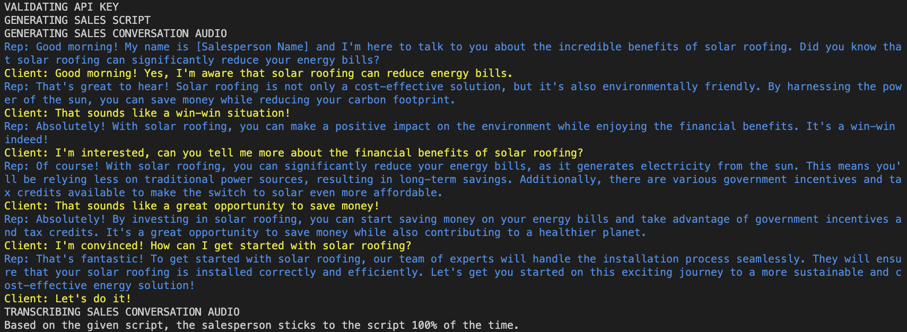

# StickToScript
#### Leverages speech recognition, large language, text to speech, and speech to text models to build a MVP that analyzes whether a company representative 'sticks to the script'

## Content Generation
#### First we generate a sales script, from that we emulate a conversation between a sales representative and a potential client. We emulate this by letting two LLM's talk to each other.

## Resulting Audio File
#### We convert their text to speech, and concatenate all their responses to create the full conversation.

## Transcription
#### We then leverage Whisper to transcribe the full conversation. With the full conversation in text and the original script, we prompt another LLM and ask it to judge how well the sales representative stuck to the script. 